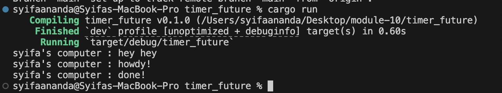
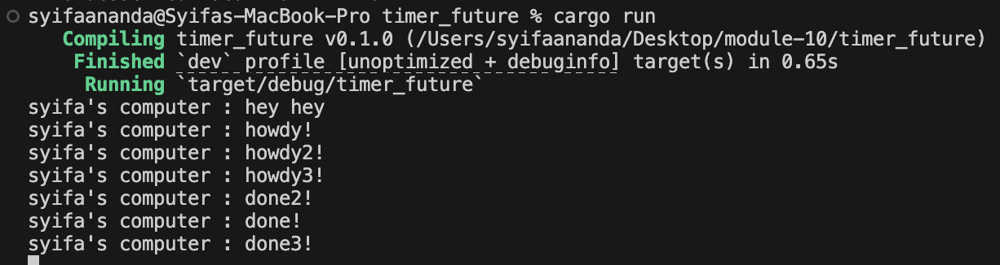
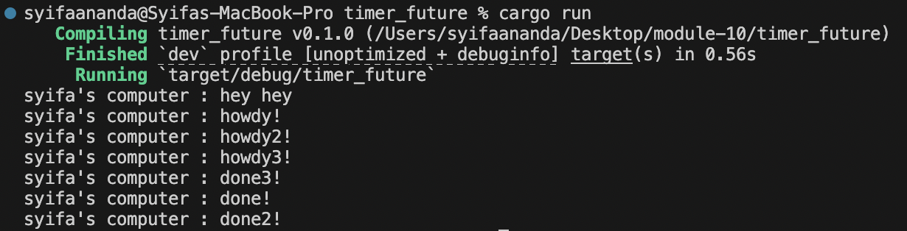

## Understanding how it works

After adding the extra log line immediately after spawner.spawn, the console shows “Experiment 1.2: Spawned the timer task, now moving on without blocking.” before anything else, right after “hey hey.” That proves that spawning a future simply queues it, it doesn’t execute or block at spawn time. Only when executor.run() is called does the executor pull the task off the channel and start polling it, which is why we then see “syifa’s computer : howdy!” followed by the two-second pause of the TimerFuture and finally “syifa’s computer : done!”. Capturing this sequence confirms the cooperative, non-blocking nature of our simple single-threaded executor, we can register tasks eagerly but control exactly when they run. This makes the overall flow easy to reason about and keeps the main thread free until we explicitly drive the futures to completion.

## Multiple spawn and removing drop

When I comment out the `drop(spawner)` line and run the program, the executor never sees the channel close, so it keeps polling and we will notice extra “done!” outputs appearing in a jumbled order. As soon as I put `drop(spawner)` back in, the executor knows no more tasks are coming and stops after each timer has fired exactly once, giving a neat sequence of “howdy!”, wait, “done!” for each spawn. The difference comes down to channel closing, dropping the last sender signals `executor.run()` to exit its loop, whereas leaving it alive leaves the loop open and can cause stray wake-ups. We can see in the first screenshot (without drop) that the “done” messages interleave unpredictably or repeat, and in the second (with drop) the prints happen cleanly and then the program exits. This simple tweak makes our single-threaded executor behave deterministically and then shut down properly when we’re done queuing work.

